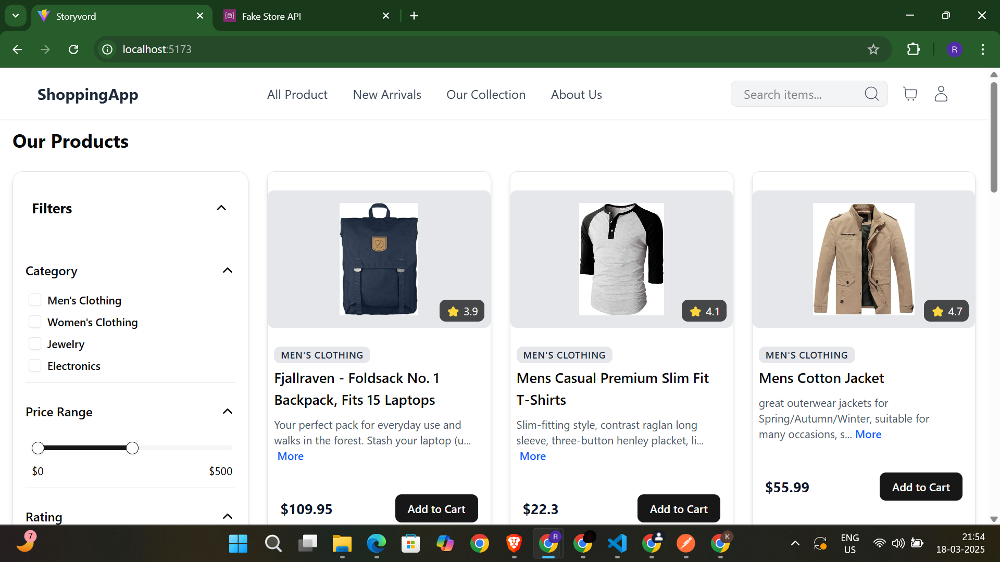
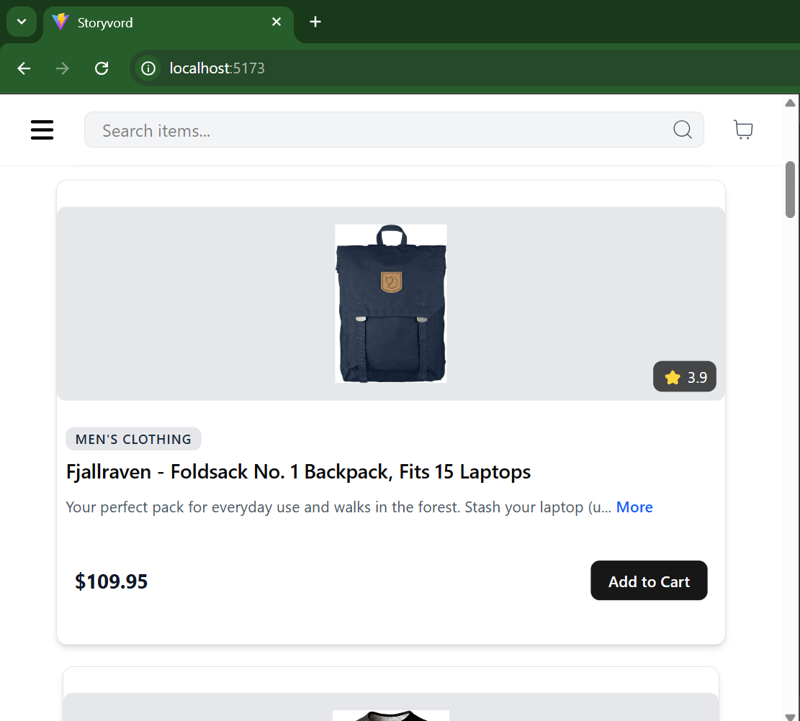
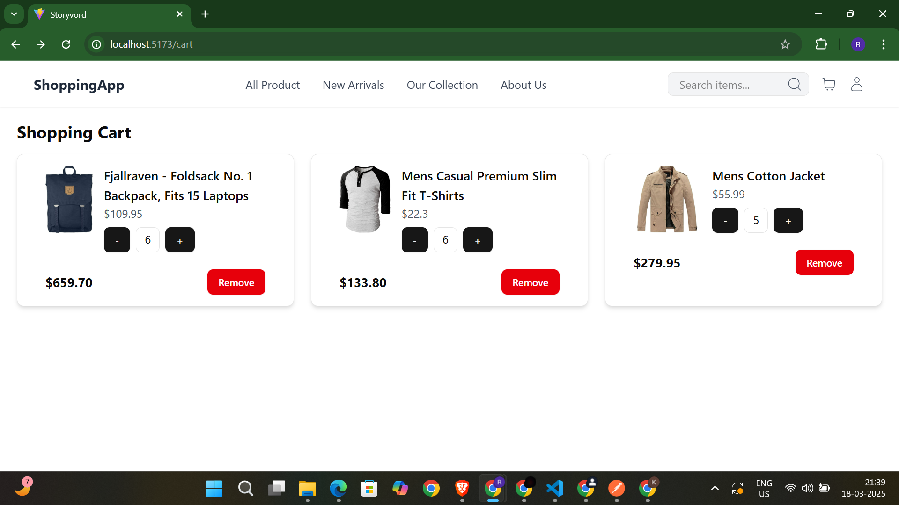
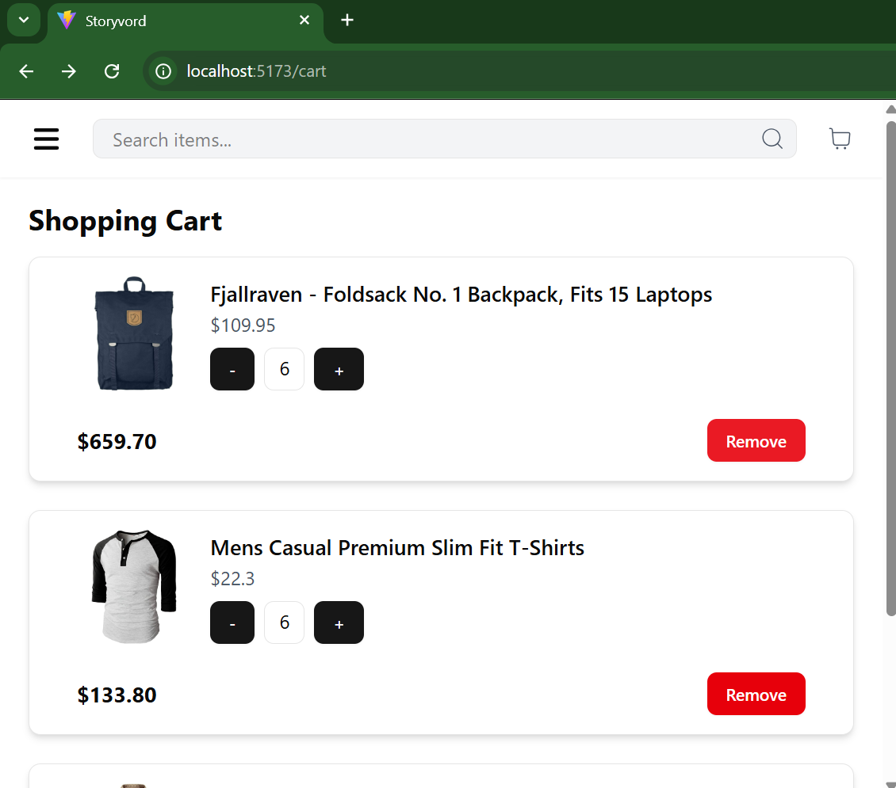

# Shopping App 🛒

This is a simple shopping application built with React, Tailwind CSS, ShadCN components, and TypeScript. The app fetches product data from the [Fake Store API](https://fakestoreapi.com/) and provides product listing and cart functionality.
[live Link](https://rohit-shooping-app.netlify.app/)
## 📸 Screenshots 

### Product Listing Page

#


### Cart Page

#


## 🚀 Features

- 📌 **Product Listing Page**: Displays all products with category filters and search functionality.
- 🛍️ **Add to Cart**: Allows users to add products to the cart.
- 🛒 **Cart Page**: Displays items in the cart, allows quantity updates, and removes items.
- 💰 **Total Calculation**: Shows the total price of the items in the cart.
- 🔄 **State Persistence**: Ensures the cart state persists across page reloads using `localStorage`.
- ⚡ **React Query**: Handles data fetching, caching, and state management.

## 🛠️ Installation

1. Clone the repository:
   ```sh
   git clone https://github.com/rohitrathod2023/shopping-app.git
   cd shopping-app
   ```

2. Install dependencies:
   ```sh
   npm install
   ```

3. Start the development server:
   ```sh
   npm run dev
   ```

4. Open [http://localhost:5173](http://localhost:5173) in your browser.

